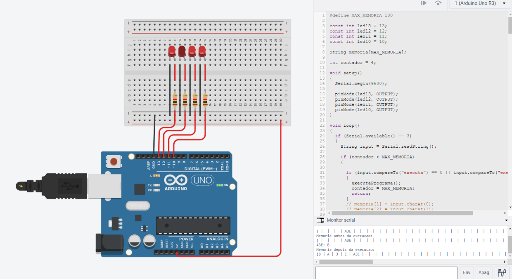
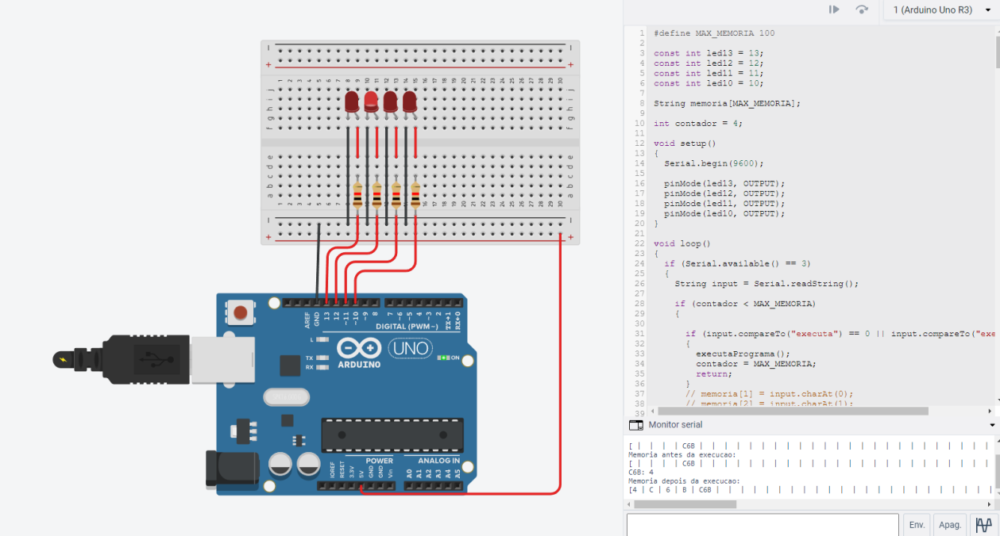

# Exercício Pratico Arquitetura de Computadores II
## Sobre o Projeto
Esse projeto é referente a materia de Arquitetura de Computadores II no meu curso de Ciência da Computação, e tem a finalidade de criar 2  programas. Um no hardware externo (Arduino) e outro no PC, que será a  
interface com o usuário. A idéia é ler um programa escrito pelo usuário, transformá-lo em mnemônicos gerando outro programa e finalmente passá-lo ao Hardware externo através da porta serial e realizar algum processamento 
nesse Hardware. O resultado será observado nos 4 Leds conectados no Hardware externo. 

## Finalidade do Projeto
- Um programa no Arduino que simule uma ULA e receba os valores dos dados e instruções através da porta 
serial ou sejam digitados. 
- Um programa de acesso em C/C++/Java/Python (com muitos comentários!) que: 
    - leia  um  programa  fonte  (com  os  dados  e  os  mnemônicos),  você  deverá  criar  um  programa  
      fonte de teste. Durante a aula um outro programa será utilizado para verificação do trabalho.  
    -  gere um arquivo hexa correspondente aos dados e instruções e  
    - envie dados e instruções através da porta Serial para a ULA (Caso um Arduino real esteja presente) 
 
O programa de teste possuirá o nome "testeula.ula" e você só terá acesso a ele no momento do teste. 
O  formato  será  o  mesmo  descrito  na  Figura  3  e  os  mnemônicos  da  Figura  2.  O  programa  gerado  
deverá possuir o nome "testeula.hex".  
Para  o  seu  teste  crie  seu  próprio  programa  fonte,  lembre-se  de  procurar  testar  todas  as  instruções  
possíveis. 

## Testes

    
    

    

    
    

    

## PDF do projeto
https://github.com/UrielAnd/ACII_ExercPratic04/blob/main/PdfProjeto.pdf

### Linguagens Ultilizadas

### Ferramentas Ultilizadas

# Desenvolvido por Uriel Andrade-26/04/2022
